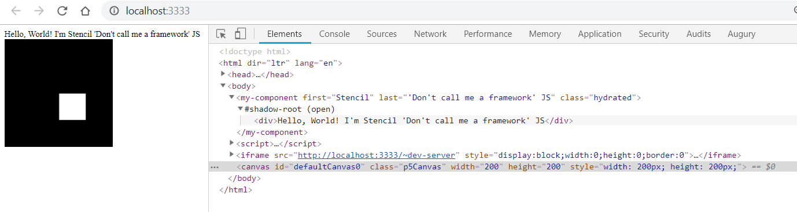

![Built With Stencil](https://img.shields.io/badge/-Built%20With%20Stencil-16161d.svg?logo=data%3Aimage%2Fsvg%2Bxml%3Bbase64%2CPD94bWwgdmVyc2lvbj0iMS4wIiBlbmNvZGluZz0idXRmLTgiPz4KPCEtLSBHZW5lcmF0b3I6IEFkb2JlIElsbHVzdHJhdG9yIDE5LjIuMSwgU1ZHIEV4cG9ydCBQbHVnLUluIC4gU1ZHIFZlcnNpb246IDYuMDAgQnVpbGQgMCkgIC0tPgo8c3ZnIHZlcnNpb249IjEuMSIgaWQ9IkxheWVyXzEiIHhtbG5zPSJodHRwOi8vd3d3LnczLm9yZy8yMDAwL3N2ZyIgeG1sbnM6eGxpbms9Imh0dHA6Ly93d3cudzMub3JnLzE5OTkveGxpbmsiIHg9IjBweCIgeT0iMHB4IgoJIHZpZXdCb3g9IjAgMCA1MTIgNTEyIiBzdHlsZT0iZW5hYmxlLWJhY2tncm91bmQ6bmV3IDAgMCA1MTIgNTEyOyIgeG1sOnNwYWNlPSJwcmVzZXJ2ZSI%2BCjxzdHlsZSB0eXBlPSJ0ZXh0L2NzcyI%2BCgkuc3Qwe2ZpbGw6I0ZGRkZGRjt9Cjwvc3R5bGU%2BCjxwYXRoIGNsYXNzPSJzdDAiIGQ9Ik00MjQuNywzNzMuOWMwLDM3LjYtNTUuMSw2OC42LTkyLjcsNjguNkgxODAuNGMtMzcuOSwwLTkyLjctMzAuNy05Mi43LTY4LjZ2LTMuNmgzMzYuOVYzNzMuOXoiLz4KPHBhdGggY2xhc3M9InN0MCIgZD0iTTQyNC43LDI5Mi4xSDE4MC40Yy0zNy42LDAtOTIuNy0zMS05Mi43LTY4LjZ2LTMuNkgzMzJjMzcuNiwwLDkyLjcsMzEsOTIuNyw2OC42VjI5Mi4xeiIvPgo8cGF0aCBjbGFzcz0ic3QwIiBkPSJNNDI0LjcsMTQxLjdIODcuN3YtMy42YzAtMzcuNiw1NC44LTY4LjYsOTIuNy02OC42SDMzMmMzNy45LDAsOTIuNywzMC43LDkyLjcsNjguNlYxNDEuN3oiLz4KPC9zdmc%2BCg%3D%3D&colorA=16161d&style=flat-square)

# Using P5 in a webcomponent

## Intro

This project demoes:

* HowTo use [p5.js](https://p5js.org/examples/) in a webcomponent created by the [Stencil](https://stenciljs.com/) webcomponent builder.  

The basic start [basic start](https://github.com/rasor/stncl-p5-poc/tree/chpt1) can be used in a usecase, where you want to [package your P5 creation in an npm package](https://stenciljs.com/docs/distribution) and [publish it to NPM](https://docs.npmjs.com/packages-and-modules/contributing-packages-to-the-registry).  
This work is based on [webpack](https://github.com/p5-types/p5.ts/blob/master/examples/webpack/src/index.ts)-sample.

The next use case is to let a consumer provide the P5 skecth instance to a canvas-hosting webcomponent.  
This work is based on [create-react-app](https://github.com/p5-types/p5.ts/tree/master/examples/create-react-app)-sample. It is not fully done. PR's are welcome. 

## How this project was build

```bash
npm init stencil
# you get a menu - choose component
# Name of proejct: stncl-p5-poc

# Add dependencies:
npm install p5 --save
npm install @types/p5 --save-dev

# Test run: Build, start a webserver and a browser:
npm start

# Kill webserver:
ctrl-c
```

Add P5 to your webcomponent:  
Edit webcomponent \stncl-p5-poc\src\components\my-component\my-component.tsx  
```typescript
// import p5
import p5 from 'p5';

// Paste demo code from
// https://github.com/p5-types/p5.ts/blob/master/examples/webpack/src/index.ts
function s(sketch: p5) {
  const x = 100;
  const y = 100;

  sketch.setup = () => {
    sketch.createCanvas(
      200,
      200
    );
  };

  sketch.draw = () => {
    sketch.background(
      0
    );
    sketch.fill(
      255
    );
    sketch.rect(
      x,
      y,
      50,
      50
    );
  };
};

const myp5 = new p5(
  s
);
```

Now run the project once more.  
Thats it!  



## Credits

Thanks to  

* [Stencil](https://stenciljs.com/)
* P5 samples by [Zalastax](https://github.com/Zalastax)

## Refs

* [Getting Started with StencilJS](https://cloudinary.com/blog/getting_started_with_stenciljs)

The End